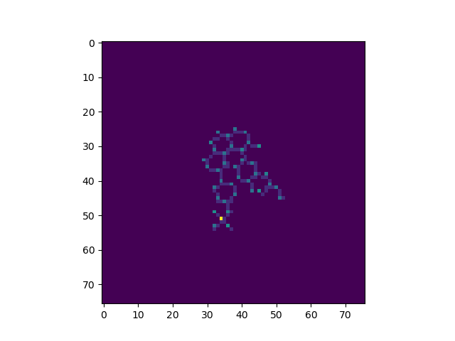

# Installation in Ubuntu using conda
First create an environment that contains rdkit
`conda create -c conda-forge -n drugdealer rdkit` and activate with `conda activate drugdealer`
Then run these commands (conda env file cannot be used due to the already existent environment)
```
pip install pyfiglet
pip install deepchem 
pip install pyYAML
pip install tqdm
conda install -c conda-forge lightning
```
You might have to reinstall some pytorch dependencies depending on which CUDA drivers you have. 
After the installation, run to the project directory the command:
```
pip install -e . 
```
and to verify the installation type 
```
drugdealer --help
```
Modify the following 3 paths from the`config_file.yml` 
```
  root_dir: PROJECT_DIR
  data_dir: 'PROJECT_DIR/resources/data_files'
  processed_dir: 'PROJECT_DIR/resources/processed_data'
```
Now copy the file from the assessment `gdsc-rnaseq_gene-expression.csv` into ` PROJECT_DIR/resources/data_files` (it was too heavy to upload to github like the others.)
The package contains 2 different modes (it was intented for 3 but there was not time):
1) **dataprocess**: For execution `drugdealer dataprocess config_file.yml`
This module applies mainly the following steps: <br />
A) Filters out data points which their corresponding cell line does not have a gene expression. <br />
B) Filters out data points which their correspondind drug does not have smile representatin. <br />
C) Featurizes smiles into images using this paper: [1] Goh, Garrett B., et al. "Using rule-based labels for weak supervised
        learning: a ChemNet for transferable chemical property prediction."
        Proceedings of the 24th ACM SIGKDD International Conference on Knowledge
        Discovery & Data Mining. 2018. <br />
   An example using a random smile is the following: <br />
   
2) **train**: For execution run `drugdealer train config_file.yml` <br />
This step train a DL model to predict the ic50 values. It has 2 layers, one to process the images and one to process the gene_expressions. Then the extracted features are fused and passed into an FC layer where they are project into one dimension for MSE calculation.
3) Unfortunately there was no time to implement the validation step. 

